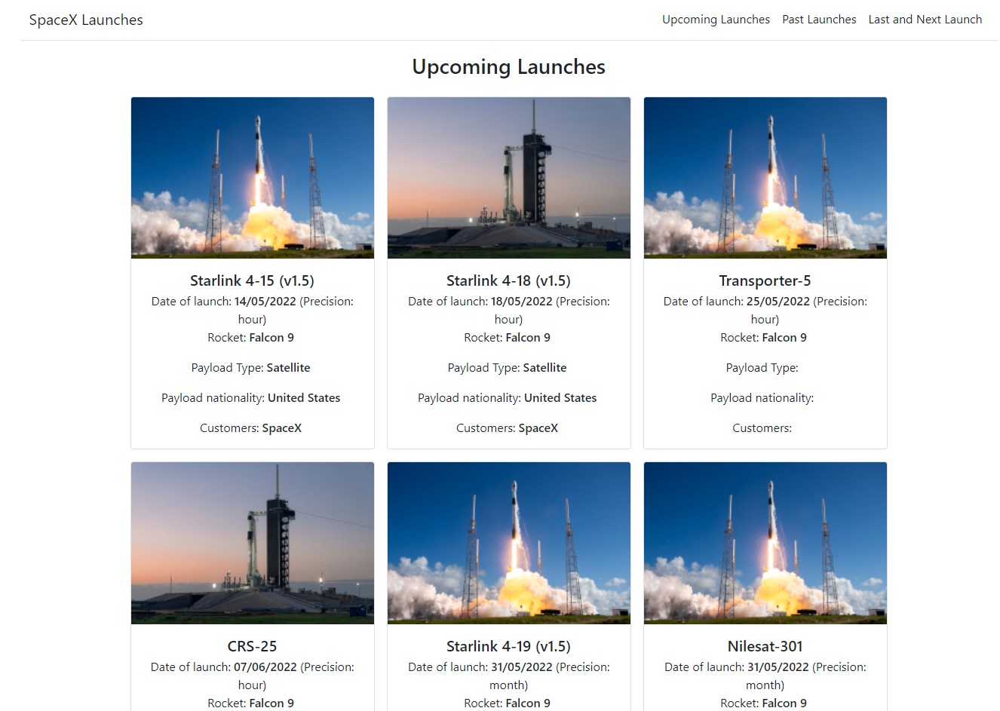
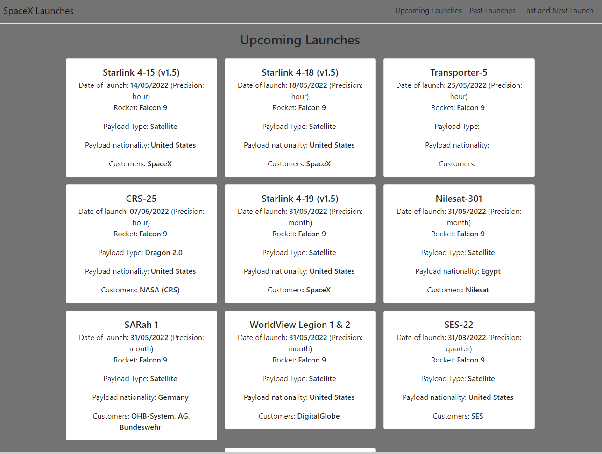

# SpaceX Launches APP

WebApp feito para exibir os lançamentos da SpaceX separados em tres parte:

- Lançamentos Futuros https://spacexapp.felipecordeiro.dev/
- Lançamentos Passados https://spacexapp.felipecordeiro.dev/past
- Próximo e último lançamentos

WebApp construido usando React para o front-end e express.js com typescript para o back-end.

Para buscar os lançamentos, é realizado uma chamada a [API open-source da SpaceX](https://github.com/r-spacex/SpaceX-API) o usando o servico [SpaceXAPI.ts](https://github.com/felipemcord/NodeSpaceXAPI/blob/master/services/SpaceXAPI.ts). A resposta é mapeada para o [modelo](https://github.com/felipemcord/NodeSpaceXAPI/tree/master/models) do app e disponibilizada nos [endpoints](https://github.com/felipemcord/NodeSpaceXAPI/blob/master/routes/index.ts).

Para exibir os lançamentos, foram criados 3 componentes principais:
- Components/UpcomingLaunches.js
- Components/PastLaunches.js
- Components/NextAndLast.js
Cada um desses componentes faz uma requisição a um endpoint especifíco da API usando o wrapper definido em lib/apiWrapper.js. O wrapper usa de uma variavél de ambiente para definir o a URL da API.

O Componente LaunchCard é usado para exibir um único lançamento, definindo quais informações serão exibidas. LaunchGroup é usado nas telas que exibem vários lançamento para definir as regras de exibição de um grupo de lançamentos.

Para navegar entre as páginas foi usado ReactRouter com o componente NavBar permitindo a navegação.

Foi usado Reactstrap para facilitar na montagem do layout.

Foi criado um teste A/B usando Google Optimize com uma variação:
- Original 
- Variação 1 

Também foi utilizado HotJar para realizar [gravações de tela](https://insights.hotjar.com/r?site=2969959&recording=12295776060&token=cb0f7f6ddd9dd82919d2cb3bef7bb837) e criar heatmaps

## Instruções para executar

Para iniciar o projeto em uma máquina local bastar executar `docker-compose up`. O WebApp estará disponivel em `localhost:3000` e a API em `localhost:4000`.

Para realizar o deploy da aplicação foi utilizado nginx proxy com o acme-companion, seguindo o [docker-compose](https://gist.github.com/felipemcord/9a2773112691570c7c74923a41f8053a). Usando estes containers como infraestrutura, basta executar o docker-compose.production.yml alterando as URL para aquelas desejadas.